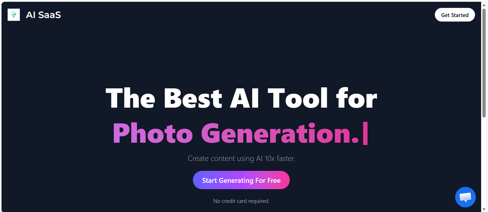
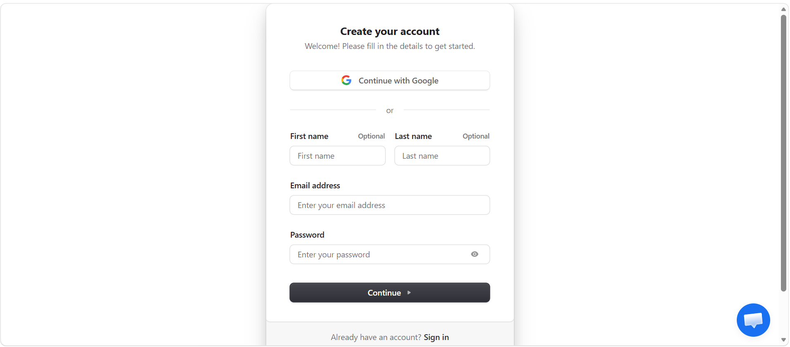
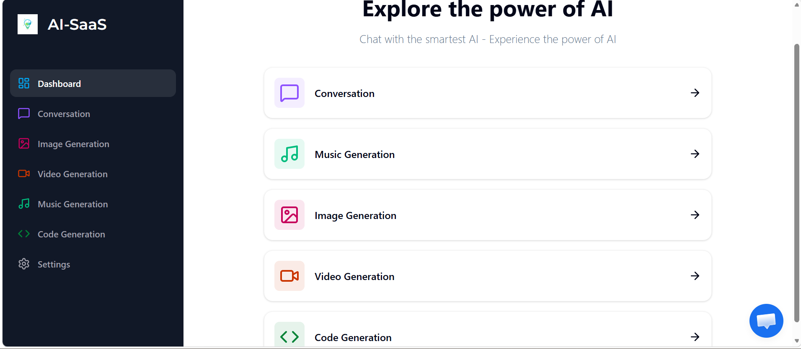

# 🚀 AI SaaS Platform

A full-stack AI SaaS application built with **Next.js 13 App Router** that enables users to generate AI-powered content such as conversations, code, images, music, and videos.

---

## ✨ Features

* 🤖 AI Chatbot (OpenAI)
* 💻 Code Generation
* 🖼️ Image Generation
* 🎵 Music Generation (Replicate)
* 🎬 Video Generation (Replicate)
* 🔐 Authentication & User Management (Clerk)
* 💳 Subscription & Payments (Stripe)
* 📊 Dashboard with API usage tracking
* ⚡ API limit control with UI counter
* 🎯 Pro plan upgrade system
* 📩 Customer support integration

---

## 🛠️ Tech Stack

* **Frontend:** Next.js 13, React, Tailwind CSS
* **Backend:** Next.js API Routes / Server Actions
* **Database:** PostgreSQL (Neon) + Prisma ORM
* **Authentication:** Clerk
* **Payments:** Stripe
* **AI APIs:** OpenAI, Replicate
* **Deployment:** Vercel

---

## 📦 Installation

Clone the repository:

```bash
git clone https://github.com/suchanda-ux/AI-Saas-Project.git
cd AI-Saas-Project
```

Install dependencies:

```bash
npm install
```

Run the development server:

```bash
npm run dev
```

Open in browser:

```
http://localhost:3000
```

---

## 🌐 Live Demo

Coming soon (will be deployed on Vercel)

---

## 📸 Screenshots






---

## 📚 What I Learned

* Building scalable SaaS applications using Next.js 13
* Integrating multiple AI APIs into a single platform
* Implementing authentication and subscription systems
* Managing API limits and user-based access

---

## 🤝 Contributing

Feel free to fork this repository and improve it.

---

## 📩 Contact

**Suchanda Kundu**
https://www.linkedin.com/in/suchandakundu/

---
